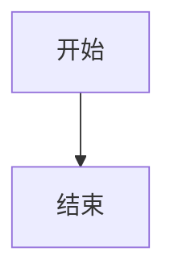

# 手动测试文档 — Markdown 编辑与阅读体验优化

> 分支：`feat/markdown-ux`（基线 `feat/merge-upstream-1.2.0`，共 8 个提交）
> 范围：阅读体验包（限宽排版/返回顶部、语法高亮、图片查看器、大纲面板）+ 编辑增强包（快捷键、智能续行、Tab 缩进、自动配对、富文本粘贴转 Markdown、查找替换）
> 约定：编辑增强仅作用于**主窗口编辑器**；便签窗口与磁贴为回归验证对象，不应出现新行为。

---

## 0. 环境准备

1. `npm install && npm run tauri dev` 启动开发版。
2. 新建笔记「体验测试」，将 [附录 A 测试素材](#附录-a-测试素材) 全文粘贴进去，切换到**预览**视图。
3. 另准备：一张可粘贴的截图（供图片查看器用例）、一个浏览器标签页（供富文本粘贴用例）。
4. 长文档用例：将测试素材再复制 9 份接到文末（构造超过 10 屏的内容）。
5. 建议按文档顺序执行；A1–A4（预览侧）与 B1–B6（编辑侧）相互独立，可分两次会话完成。
6. 每个用例记录：☐ 通过 / ☐ 失败（失败时填写缺陷编号，登记到文末缺陷表）。

## 0.1 用例与提交对照

| 模块                     | 对应提交 |
| ------------------------ | -------- |
| A1 语法高亮              | 6faf0a5  |
| A2 大纲面板              | 75e324c  |
| A3 图片查看器            | 3d88715  |
| A4 限宽排版 + 返回顶部   | 3321a9a  |
| B1 格式快捷键            | 6dc4c23  |
| B2 智能续行              | 6dc4c23  |
| B3 Tab 缩进              | b312a17  |
| B4 自动配对              | b312a17  |
| B5 富文本粘贴转 Markdown | 72b918a  |
| B6 查找替换              | 72b918a  |

---

## A1 代码块语法高亮

前置：测试素材已粘贴，设置中「渲染 HTML」先保持关闭。

| #    | 操作                                  | 预期                                                                                  | 结果 |
| ---- | ------------------------------------- | ------------------------------------------------------------------------------------- | ---- |
| A1-1 | 预览中查看 ```js 代码块               | 出现 `hljs` 配色：`const` 为赤陶红粗体、`42` 琥珀色、注释灰色斜体；代码块背景仍为纸色 | ☐    |
| A1-2 | 查看 ```text 与无语言代码块           | 纯文本无着色；text 块左上角语言角标正常显示                                           | ☐    |
| A1-3 | 查看 mermaid 块                       | 图表正常渲染，未被高亮逻辑影响（应显示图形而非源码）                                  | ☐    |
| A1-4 | 代码块 hover → 点击「复制」           | 复制内容为完整源码（含缩进与换行），按钮出现「已复制」反馈                            | ☐    |
| A1-5 | 切换 明色 ↔ 暗色主题（含跟随系统）    | 代码配色随主题切换；暗色下关键字/字符串/函数色均清晰可读，无低对比文字                | ☐    |
| A1-6 | 设置开启「渲染 HTML」→ 重新查看代码块 | 高亮依然生效（sanitize 在高亮之前执行，token 不被清洗）；再关闭恢复                   | ☐    |
| A1-7 | 行内代码（如 `行内代码`）             | 行内代码保持现有样式，无 hljs 着色                                                    | ☐    |
| A1-8 | 首屏性能感受：新建笔记直接输入代码块  | 预览中高亮随内容即时出现，无可感知卡顿（高亮代码在懒加载 chunk 内）                   | ☐    |

## A2 大纲面板

前置：素材含 1–4 级标题；窗口宽度足够（预览栏宽 ≥ 620px）。

| #    | 操作                                   | 预期                                                                 | 结果 |
| ---- | -------------------------------------- | -------------------------------------------------------------------- | ---- |
| A2-1 | 预览视图查看右侧                       | 右上角出现「大纲」面板，标题按级别缩进显示（H1 顶格，层级递增 10px） | ☐    |
| A2-2 | 点击大纲中「二级标题 B」               | 预览平滑滚动到该标题，标题距顶约 16px；分栏模式下编辑器滚动同步跟随  | ☐    |
| A2-3 | 手动滚动预览                           | 当前所在章节在大纲中高亮（竹绿色、加粗），滚动跨章时高亮跟随         | ☐    |
| A2-4 | 点击面板头部折叠按钮                   | 收起为右上角小图标；点击小图标恢复面板                               | ☐    |
| A2-5 | 新建一篇无标题（纯正文）笔记           | 大纲面板不出现                                                       | ☐    |
| A2-6 | 在编辑区新增一个 `## 新标题`           | 约 0.2–0.5s 后大纲出现该条目，无需刷新                               | ☐    |
| A2-7 | 拖窄窗口或缩小分栏比例使预览栏 < 620px | 大纲面板自动隐藏；拖宽后恢复                                         | ☐    |
| A2-8 | 长文档中点击返回顶部按钮后再看大纲     | 高亮回到首章；返回顶部按钮（右下）与大纲（右上）不重叠               | ☐    |

## A3 图片查看器（Lightbox）

前置：笔记中至少有一张图片（可先在编辑区粘贴一张截图生成 ``）。

| #    | 操作                                   | 预期                                                               | 结果 |
| ---- | -------------------------------------- | ------------------------------------------------------------------ | ---- |
| A3-1 | 预览中点击图片                         | 全屏半透明遮罩 + 图片居中显示，右上角有 × 按钮                     | ☐    |
| A3-2 | 滚轮放大 / 缩小                        | 以鼠标指针为锚缩放（指针下的图像内容点不漂移）；最大 8x、最小 0.2x | ☐    |
| A3-3 | 按住左键拖拽                           | 图片平移；拖拽中光标为 grab，按住为 grabbing                       | ☐    |
| A3-4 | 双击图片                               | 复位为原始大小与位置                                               | ☐    |
| A3-5 | 分别按 ESC、点击遮罩空白处、点击 ×     | 三种方式均关闭查看器，回到预览                                     | ☐    |
| A3-6 | 打开查看器后滚动鼠标滚轮               | 背景预览**不**跟随滚动（滚轮被拦截）                               | ☐    |
| A3-7 | 钉一张渲染 Markdown 的磁贴，点击其图片 | 磁贴中不触发全屏查看器（无 zoom 光标）                             | ☐    |
| A3-8 | 关闭后 Ctrl+Z 检查编辑区               | 查看器操作未对笔记内容产生任何改动                                 | ☐    |

## A4 阅读排版与返回顶部

| #    | 操作                 | 预期                                                               | 结果 |
| ---- | -------------------- | ------------------------------------------------------------------ | ---- |
| A4-1 | 宽窗口纯预览视图     | 正文限宽 820px 居中，两侧留白均匀；表格/代码块同样受限宽约束       | ☐    |
| A4-2 | 分栏模式拖窄右栏     | 内容不足 820px 时占满可用宽度，无异常留白                          | ☐    |
| A4-3 | 长文档滚动超过一屏   | 右下角浮现圆形返回顶部按钮；滚回顶部后消失                         | ☐    |
| A4-4 | 点击返回顶部         | 平滑滚回顶部，按钮消失                                             | ☐    |
| A4-5 | 切换到另一篇笔记     | 预览滚动复位到顶部，按钮不残留                                     | ☐    |
| A4-6 | 分栏模式下滚动编辑器 | 预览同步滚动正常（限宽包裹层未破坏块级锚点），双向同步、无回环抖动 | ☐    |

---

## B1 格式快捷键

前置：焦点在编辑区 textarea 内；中文输入法已开启（供 IME 用例）。

| #    | 操作                               | 预期                                                                        | 结果 |
| ---- | ---------------------------------- | --------------------------------------------------------------------------- | ---- |
| B1-1 | 选中文字按 `Ctrl+B`                | 变为 `**选中文字**`                                                         | ☐    |
| B1-2 | 无选区按 `Ctrl+B`                  | 插入 `**粗体文本**` 且「粗体文本」被选中，可直接覆盖输入                    | ☐    |
| B1-3 | `Ctrl+I` 同理验证                  | 行为同上加粗 → 斜体 `*…*`                                                   | ☐    |
| B1-4 | 选中文字按 `Ctrl+K`                | 变为 `[选中文字](https://)`，且 `https://` 被选中，直接输入网址即可替换     | ☐    |
| B1-5 | 无选区按 `` Ctrl+` ``              | 插入成对反引号（行内代码态）；选中多行按 `` Ctrl+` `` 转围栏代码块          | ☐    |
| B1-6 | 中文 IME 组合输入过程中按 `Ctrl+B` | 不打断拼音组合、不插入 `**`（IME 期间快捷键全部放行）                       | ☐    |
| B1-7 | 上述任一快捷键后按 `Ctrl+Z`        | 单步撤销整个插入/包裹                                                       | ☐    |
| B1-8 | 工具栏                             | 斜体按钮右侧新增 🔗 按钮，hover 提示「链接（Ctrl+K）」，点击效果同 `Ctrl+K` | ☐    |
| B1-9 | 便签窗口按 `Ctrl+B`/`Ctrl+K`       | 无任何格式动作（便签不接入增强）                                            | ☐    |

## B2 智能续行（回车）

前置：编辑区逐行输入以下内容，行末按 Enter 观察行为。

| #     | 当前行（`                  | ` 为光标）               | 按 Enter 后                                  | 结果 |
| ----- | -------------------------- | ------------------------ | -------------------------------------------- | ---- |
| B2-1  | `- 项目                    | `                        | 新行自动出现 `- `，光标在其后                | ☐    |
| B2-2  | `3. 第三项                 | `                        | 新行 `4. `                                   | ☐    |
| B2-3  | `2) 括号项                 | `                        | 新行 `3) `（保留括号风格）                   | ☐    |
| B2-4  | `- [ ] 待办                | `                        | 新行 `- [ ] `（未勾选态）                    | ☐    |
| B2-5  | `- [x] 已完成              | `                        | 新行 `- [ ] `（不延续勾选）                  | ☐    |
| B2-6  | ` - 嵌套项                 | `（缩进 2 空格）         | 新行保持相同缩进 ` -`                        | ☐    |
| B2-7  | 空列表项 `-                | `                        | marker 被删除，光标到行首（退出列表）        | ☐    |
| B2-8  | 空任务项 `- [ ]            | `                        | 整段前缀删除（退出任务列表）                 | ☐    |
| B2-9  | `> 引用                    | `                        | 新行 `> `                                    | ☐    |
| B2-10 | 空引用行 `>                | `                        | 删除 `> `（退出引用）                        | ☐    |
| B2-11 | `> - 引用内列表            | `                        | 新行 `> - `                                  | ☐    |
| B2-12 | `- 前                      | 后`（光标在文字中间）    | 正确分割：当前行保留「后」，新行 `- ` 在中间 | ☐    |
| B2-13 | 代码块内（``` 围栏中）回车 | 普通换行，无 marker 续行 | ☐                                            |
| B2-14 | 普通段落文字行末回车       | 普通换行                 | ☐                                            |
| B2-15 | 任意位置 `Shift+Enter`     | 软换行（不生成 marker）  | ☐                                            |
| B2-16 | 任一续行后 `Ctrl+Z`        | 单步回退                 | ☐                                            |

## B3 Tab 列表感知缩进

前置：设置中确认「Tab 缩进宽度」（默认 2）。

| #     | 操作                                    | 预期                                                 | 结果 |
| ----- | --------------------------------------- | ---------------------------------------------------- | ---- |
| B3-1  | 光标在 `- 项目` 行内按 Tab              | 整行变为 `  - 项目`（行首加深一层，光标随行平移）    | ☐    |
| B3-2  | 同行按 `Shift+Tab`                      | 恢复 `- 项目`                                        | ☐    |
| B3-3  | `1. 甲` 行 Tab 后回车再 Tab（两层列表） | 第二层 ` 2.` 正常续行且预览渲染为嵌套列表            | ☐    |
| B3-4  | 选中「列表行 + 普通文字行」多行按 Tab   | 仅列表行缩进，普通行不动                             | ☐    |
| B3-5  | 选中多个列表行按 `Shift+Tab`            | 全部减一层；已顶格的行保持不动                       | ☐    |
| B3-6  | `> - 引用内列表` 行按 Tab               | `> ` 前缀不动，列表内容缩进为 `>   - …`              | ☐    |
| B3-7  | 普通段落行（无列表）按 Tab              | 光标处插入缩进（通用缩进回落），**焦点不跳出编辑区** | ☐    |
| B3-8  | 普通行按 `Shift+Tab`                    | 行首删除最多一个缩进单位的空白；顶格行无变化         | ☐    |
| B3-9  | 设置把 Tab 缩进宽度改为 4，再按 Tab     | 缩进量为 4 空格                                      | ☐    |
| B3-10 | 任一缩进后 `Ctrl+Z`                     | 单步撤销                                             | ☐    |
| B3-11 | 便签窗口中按 Tab                        | 行为与旧版一致（通用缩进），无列表感知               | ☐    |

## B4 自动配对与包裹

| #     | 操作                                                     | 预期                                                | 结果                                         |
| ----- | -------------------------------------------------------- | --------------------------------------------------- | -------------------------------------------- | --- | --- |
| B4-1  | 选中「文字」按 `*`                                       | `*文字*` 且文字仍被选中                             | ☐                                            |
| B4-2  | 选中后分别按 `_` `` ` `` `$`                             | 对应单符号包裹                                      | ☐                                            |
| B4-3  | 选中后按 `~` / `=`                                       | 直接生成 `~~文字~~` / `==文字==`（双符号围栏）      | ☐                                            |
| B4-4  | 选中后按 `[` / `(`                                       | `[文字]` / `(文字)`                                 | ☐                                            |
| B4-5  | 空光标按 `` ` ``                                         | 成对插入，光标居中                                  | ☐                                            |
| B4-6  | 空光标按 `[` / `(`                                       | `[                                                  | ]`/`(                                        | )`  | ☐   |
| B4-7  | 空光标按 `$` `*` `=` `~`                                 | 普通字符原样输入，不配对（保护 `价格 $100` 类文本） | ☐                                            |
| B4-8  | 词字符旁按 `[`（如输入 `a` 后紧跟 `[`）或 `(` 后紧跟字母 | 不配对，原样输入                                    | ☐                                            |
| B4-9  | `` `                                                     | ` ``（光标在闭合符前）再按 `` ` ``                  | 光标跳过已有闭合符，不重复插入；`]` `)` 同理 | ☐   |
| B4-10 | 任一配对后 `Ctrl+Z`                                      | 单步撤销                                            | ☐                                            |
| B4-11 | 中文 IME 组合中按上述符号                                | 打断感无、不触发配对（IME 优先）                    | ☐                                            |

## B5 富文本粘贴转 Markdown

前置：编辑区焦点内，剪贴板按各行准备。

| #     | 剪贴板来源与内容                     | 粘贴后预期                                                               | 结果 |
| ----- | ------------------------------------ | ------------------------------------------------------------------------ | ---- | ------------------------------ | --- |
| B5-1  | 浏览器网页：带标题/加粗/链接的段落   | 转为 `#`/`**…**`/`[文字](网址)` 源码                                     | ☐    |
| B5-2  | 浏览器网页：HTML 表格                | 转为 GFM 管道表格（含 `                                                  | ---  | `分隔行，单元格内`\|` 被转义） | ☐   |
| B5-3  | 浏览器网页：嵌套列表                 | 转为带两空格缩进的嵌套列表                                               | ☐    |
| B5-4  | 浏览器网页：含 `<script>`/样式的区块 | 脚本样式被丢弃，仅正文转换                                               | ☐    |
| B5-5  | 网页中带 data: 内嵌 base64 图片      | 降级为 alt 文本，不产生超长 data 链接                                    | ☐    |
| B5-6  | VS Code 复制一段代码                 | 粘贴为与源码一致的纯文本（转换结果与纯文本相同时自动回落默认粘贴）       | ☐    |
| B5-7  | 记事本 / 微信聊天窗口复制纯文本      | 原样粘贴，无转换                                                         | ☐    |
| B5-8  | Word / 飞书文档复制格式化内容        | 能得到结构合理的 Markdown（允许格式细节不完美，不得报错或丢内容）        | ☐    |
| B5-9  | 系统截图后 `Ctrl+V`                  | 仍走图片粘贴逻辑：图片落盘、插入 ``（优先级高于 HTML 转换） | ☐    |
| B5-10 | 任一转换粘贴后 `Ctrl+Z`              | 单步撤销全部插入内容                                                     | ☐    |
| B5-11 | 便签窗口粘贴网页富文本               | 不转换，原样纯文本（便签未接入）                                         | ☐    |

## B6 查找替换

前置：长文档笔记，含重复出现的词（如 10 处「标题」）。

| #     | 操作                              | 预期                                                 | 结果 |
| ----- | --------------------------------- | ---------------------------------------------------- | ---- |
| B6-1  | 编辑区内按 `Ctrl+F`               | 工具栏下方出现查找条，光标自动落在查找输入框         | ☐    |
| B6-2  | 输入「标题」                      | 计数实时显示 `1/10`；继续输入时计数刷新              | ☐    |
| B6-3  | `Enter` 或 ↓                      | 跳到下一匹配并循环回绕；编辑区滚动使选区可见         | ☐    |
| B6-4  | `Shift+Enter` 或 ↑                | 跳到上一匹配                                         | ☐    |
| B6-5  | 查询一个不存在的词                | 显示「无匹配」，上一/下一无动作                      | ☐    |
| B6-6  | 点 `Aa` 后查询大小写混合词        | 切换为区分大小写，计数随之变化；按钮高亮表示开启     | ☐    |
| B6-7  | 点 `⇄` 展开替换行                 | 出现「替换为」输入框与「替换」「全部替换」按钮       | ☐    |
| B6-8  | 输入替换文本后点「替换」          | 当前匹配被替换，停留在下一个匹配处；逐次点击逐个替换 | ☐    |
| B6-9  | 点「全部替换」                    | 一次替换全部；`Ctrl+Z` 单步撤销全部替换              | ☐    |
| B6-10 | 查询 `a` 替换为 `aa` 执行全部替换 | 结果正确无二次展开（原 3 个 a → 6 个 a）             | ☐    |
| B6-11 | 在查找框按 `Esc` 或点 ×           | 查找条关闭，焦点回到编辑区                           | ☐    |
| B6-12 | 查找并替换含中文/emoji 的文本     | 定位与替换的偏移正确，不出现错位截断                 | ☐    |

---

## R 回归测试（重点：改动未破坏原有能力）

| #    | 操作                                                    | 预期                                                                                                                                      | 结果 |
| ---- | ------------------------------------------------------- | ----------------------------------------------------------------------------------------------------------------------------------------- | ---- |
| R-1  | 编辑中持续输入中文（IME）+ 混合回车/Tab                 | 组合输入不被打断；上屏内容正确                                                                                                            | ☐    |
| R-2  | `Ctrl+S` 手动保存 / 停顿 900ms 自动保存                 | 保存状态提示正常流转（未保存→保存中→已保存）                                                                                              | ☐    |
| R-3  | 分栏滚动同步来回滚动                                    | 双向同步、块级对齐、无回环抖动（原有能力，A4/A2 改动后复核）                                                                              | ☐    |
| R-4  | 笔记列表：新建/切换/删除/分类移动/导入导出              | 全部正常；切换笔记后编辑器、预览、大纲、返回顶部状态全部复位                                                                              | ☐    |
| R-5  | 便签全流程：快捷键呼出 → 输入 → 保存 → 空便签关闭不落库 | 与旧版一致，无新增行为                                                                                                                    | ☐    |
| R-6  | 磁贴：钉屏/取钉/双击编辑（若开启）/渲染 Markdown        | 磁贴图片无 lightbox，其余与旧版一致                                                                                                       | ☐    |
| R-7  | 外部 .md 文件：拖入打开、编辑、自动保存                 | 正常，外部文件轮询不受影响                                                                                                                | ☐    |
| R-8  | 语言切换 简体/繁體/English                              | 新 UI 文案全部随语言切换：大纲、返回顶部、查找条（查找/替换为/无匹配/区分大小写/上一个/下一个/展开替换/替换/全部替换/关闭）、链接按钮提示 | ☐    |
| R-9  | 明暗主题下巡检所有新 UI                                 | 大纲面板、返回顶部、查找条、Lightbox 遮罩、代码高亮均清晰可读                                                                             | ☐    |
| R-10 | `npm test`、`npm run lint`、`npx tsc --noEmit`          | 全绿（236 测试 / 0 警告 / 0 错误）                                                                                                        | ☐    |

## K 已知边界（不算缺陷，用于校准预期）

1. 编辑增强（B1–B6）只作用于主窗口编辑器；便签、磁贴、外部文件编辑区不接入。
2. `Ctrl+F` 需焦点在编辑区内；焦点在笔记列表/设置时不响应（设计如此，避免劫持全局快捷键）。
3. 大纲面板在预览栏宽 < 620px 时自动隐藏；笔记无标题时不出现。
4. 图片查看器最大 8x / 最小 0.2x；不提供保存缩放状态的持久化。
5. 富文本转换以「结构合理」为目标，Word/网页复杂排版（多级嵌套表格、脚注等）允许简化，data: 图片降级为 alt 文本。
6. `$` 与 `*` 不参与空光标自动配对（保护普通文本），仅在有选区时用于包裹/围栏。
7. 预览限宽固定 820px，未提供设置项（轻量化取舍）。

---

## 附录 A 测试素材

新建笔记「体验测试」，粘贴以下全文（```围栏为素材的一部分，整段复制时请从**原始 md 文件**复制以免嵌套围栏被解析）：

````markdown
# 花笺体验测试笔记

## 二级标题 A

普通段落，包含 **加粗**、_斜体_、`行内代码`、[外部链接](https://github.com)。

### 三级标题 A1

```js
const answer = 42;
// 数字与关键字应有配色
function greet(name) {
  return "Hello, " + name;
}
```

#### 四级标题 A1-1

```text
纯文本代码块，不应有着色
```

```
无语言标注的代码块
```

## 二级标题 B

- 无序列表项 1
- 无序列表项 2
  - 嵌套列表项
- [ ] 待办任务
- [x] 已完成任务

1. 有序第一项
2. 有序第二项

> 引用文字第一行
> 引用文字第二行

| 名称 | 数值 |
| ---- | ---- |
| 甲   | 1    |
| 乙   | 2    |

## 二级标题 C

$$
E = mc^2
$$

（在此处粘贴一张图片）


````

## 附录 B 缺陷记录

| 编号    | 用例 | 现象描述 | 复现步骤 | 严重程度    | 备注 |
| ------- | ---- | -------- | -------- | ----------- | ---- |
| BUG-001 |      |          |          | P0/P1/P2/P3 |      |

## 附录 C 测试结论

| 项目                | 内容                                                     |
| ------------------- | -------------------------------------------------------- |
| 测试日期            |                                                          |
| 测试人              |                                                          |
| 构建来源            | feat/markdown-ux @ commit **\_\_\_\_**                   |
| 执行用例数 / 通过数 | \_**\_ / \_\_**                                          |
| 遗留缺陷            | P0: \_**\_ P1: \_\_** P2: \_**\_ P3: \_\_**              |
| 结论                | ☐ 通过，可合并 ☐ 有条件通过（缺陷清单见附录 B） ☐ 不通过 |
